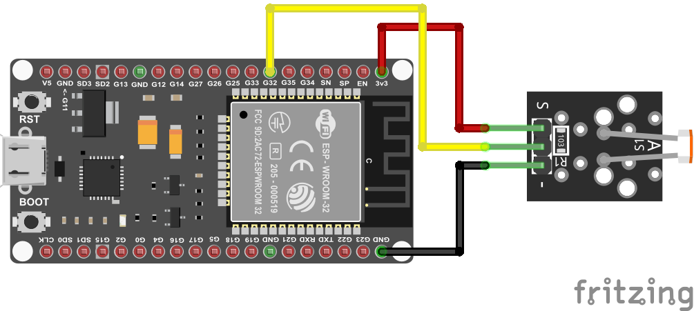

:::::::::::::::::::::::::::::::::::::: questions 

- Question

::::::::::::::::::::::::::::::::::::::::::::::::

::::::::::::::::::::::::::::::::::::: objectives

- Objective
::::::::::::::::::::::::::::::::::::::::::::::::

## Connecting a light level sensor



```c
#include <DHT.h>

#define DHT_SENSOR_TYPE DHT22
#define DHT_SENSOR_PIN 32 // ESP32 pin connected to DHT sensor
#define LIGHT_SENSOR_PIN 36 // ESP32 pin GIOP36 (ADC0)

const int readingdelay = 3000;

DHT dht_sensor(DHT_SENSOR_PIN, DHT_SENSOR_TYPE);

void setup() {
  Serial.begin(9600); // initialize serial
  Serial.println(F("Starting ..."));
  dht_sensor.begin(); // initialize the DHT sensor
}

void loop() {

  float temperature = dht_sensor.readTemperature();   // read temperature in Celsius
  int lightlevel = analogRead(LIGHT_SENSOR_PIN);     // read light level


  if (isnan(temperature)) {
 
    Serial.println("Failed to read from DHT sensor!");
  
  } else {
    
    Serial.print("Temperature: ");
    Serial.println(temperature);
    Serial.print("Light: ");
    Serial.println(lightlevel);}

  // wait a 3 seconds between readings
  delay(readingdelay);
}

```

::::::::::::::::::::::::::::::::::::: keypoints 

- Keypoint

::::::::::::::::::::::::::::::::::::::::::::::::

[r-markdown]: https://rmarkdown.rstudio.com/
