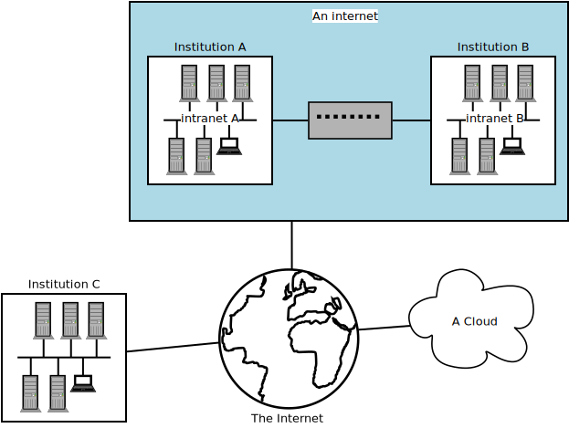

:::::::::::::::::::::::::::::::::::::: questions 

- What is the Internet of Things?
- How does one connect something to the Internet of Things?
- What is a microcontroller?
- What is an Arduino?

::::::::::::::::::::::::::::::::::::::::::::::::

::::::::::::::::::::::::::::::::::::: objectives

- Explain what the Internet of Things is.
- Explain what kind of things can be found on the Internet of Things.
- Explain how things are connected to the Internet of Things.

::::::::::::::::::::::::::::::::::::::::::::::::

## The Internet of Things

You might hear "Internet of Things" (IoT) and Arduino mentioned together and often those terms are used as if the one implies the other. However, this is not the case. The ***Internet of Things*** refers to all kinds of "Things" that have been connected to the Internet. Often, this includes sensing the environment. You can almost think of IoT as the five senses of the Internet. 

Before we continue, we should clarify some key terminology used in networking. When two or more computers are connected such that they can communicate it is called a **network**.

### LAN

When computers are connected together as in the below diagram, we call this a ***"Local Area Network"***, or LAN. This is how the computers within a university campus are connected. You may hear this referred to as the institution's ***intranet***. All the computers inside it can talk to each other, but computers outside the LAN cannot talk to them.

<figcaption align="center">
 <b>Computers connected to form a Local Area Network</b> 
</figcaption>

### WAN

A LAN is often connected to other telecommunications networks. The network of university networks in the UK is called "[Janet](https://www.jisc.ac.uk/janet)": this allows institutions to talk to each other. This forms a ***"Wide Area Network"*** or WAN, as it spans a much larger geographic distance. This network may also be referred to as **an internet** but is not the same as **The Internet**. 

<figcaption align = "center">
 <b>When two networks are connected they form an internet. These networks can connect to the worldwide internet known as The Internet.</b> 
 </figcaption>

### "The Internet" versus "an internet"
An "internet" (with a lower case i) and "The Internet" (with an upper case I) are different! With an upper case I, ***The Internet*** refers to the wide area network that we connect to view web pages such as Google, Amazon etc, or to which we connect to to make Zoom or Skype calls. The Internet is a worldwide collection of networks that we are able to connect to via our Internet Service Providers. 

With a lower case i, ***internet*** refers to a collection of networks that are connected: a contraction of the phrase "*interconnected network*". If university A has a network on campus, and university B has a network, and they decide to connect the two networks as a WAN, then they would have an internet. However they might not necessarily be connected to The Internet.

::::::::::::::::::::::::::::::::: callout

### The Cloud

You may also have heard of ***The Cloud***. The cloud refers to a collection of many, many computers which provide services and resources on the Internet. These machines might be physically located in datacentres all over the globe, but the network between them is designed to be as invisible as possible to you. We often don't care where the computer running a service in the cloud physically resides, as long as the service is reliable and can be accessed from the Internet. 

This ephemerality is why we talk about services as if they are in a "cloud": the computers and the services they run are like droplets of water floating in the sky. There are also multiple clouds in the "sky": some operated by technology companies, others smaller, such as private clouds hosted by individual institutions or companies for reasons including cost and security.

:::::::::::::::::::::::::::::::::::::::::

:::::::::::::::::::::::::::::: challenge

* What is a network?
* What is an intranet?
* What is the Internet?
* What is the difference between a LAN and a WAN?

:::::::::::::::::::::::::::::::::::::::::

:::::::::::::::::::::::::::::::: solution

* Network: a group of computers connected together. This can be via wires (electrically); microwaves (radio); or fibre optic (light).
* Intranet: a network of computers, such as the one connecting machines within the University to each other.
* The Internet: the network of networks, which connects computers across the globe together.
* A Local Area Network is situated in a small geographic area. A Wide Area Network may span countries, or even the globe. We are even starting to have PANs (Planetary Area Networks)!

:::::::::::::::::::::::::::::::::::::::::

## Microcontrollers

"So what is this Arduino thing then?", you may ask. Well, Arduinos are little devices (open-source electronics platform) that were designed to teach people about electronics and they can be used to build electronic circuits that can be connected to the Internet to serve as part of the Internet's sensing. The main component on an Arduino is a microcontroller which is an "integrated circuit" (or you might know it as a chip) that can be used in conjunction with other electronic components to control things such as motors and sensors. It is, in actual fact, a very small computer and can also be programmed. However, the Arduino is not the only such device, some other popular devices are the ESP32 and ESP8266 boards. To complicate things somewhat, each of these boards come in different flavours - or, at least, different models.

<figcaption align = "center"><b>The original and most basic Arduino - the Arduino Uno</b> SparkFun Electronics from Boulder, USA, CC BY 2.0 <https://creativecommons.org/licenses/by/2.0>, via Wikimedia Commons</figcaption>

The main thing to notice about the Arduino in the image above is that it has no connectivity to the Internet. So even if we connect sensors to the Arduino  it cannot make part of the Internet of Things without being connected to the Internet. However, one can purchase (or build it yourself) a WiFi shield that fits on top of the Arduino and with the shield in place you can program the Arduino to connect to the Internet and publish all the data it retrieves, via the sensors that you connect to it, to the Internet.

Below is an image of the WiFi shield and you might be able to see how its pins allows it to be fitted onto the Arduino Uno.

<figcaption align = "center">
 <b>A WiFi shield for the Arduino Uno</b> 
 Attribution: oomlout, CC BY-SA 2.0 <https://creativecommons.org/licenses/by-sa/2.0>, via Wikimedia Commons
 </figcaption>

 
There are now several models of Arduinos available, some with onboard WiFi or BlueTooth to allow connectivity to a network. Follow this [link to the Arduino site](https://www.arduino.cc/en/hardware) if you would like to see the whole range of Arduino models that are available.
 
 
For the purposes of this workshop your instructor might choose to not use an Arduino but rather one of the other options that are available. It doesn't really matter which one you use because for the projects covered in this lesson, any of them will do. Often, one of the ESP32 or ESP8266 series are chosen because they have onboard WiFi and are also significantly cheaper than Arduinos.
 

 <figcaption align = "center">
  <b>An ESP32 WROOM 32</b> 
  Attribution: Ubahnverleih, CC0, via Wikimedia Commons
 </figcaption>
 
 

The two main requirements for the device selected would be that it is 1) WiFi enabled and 2) can be programmed using the Arduino Integrated Development Environment (IDE). An IDE is just a computer program that provides a programming environment that makes things easier for programmers.

::: instructor

Notes for the instructor

:::

::: challenge 

## Challenge 1: Which of the following are part of the Internet of things?

With the person next to you, discuss whether you think the following devices are part of the Internet and why? What other devices do you think would make part of the Internet of Things.

1. A computer
2. An Arduino
3. A traffic camera
4. A device publishing current temperature to the Internet
5. A smart phone

:::

 
 Links:
 
 - [Microcontrollers vs Microprocessors](https://www.guru99.com/difference-between-microprocessor-and-microcontroller.html)
 - [Smartphone in the IoT Era](https://bridgera.com/smartphones-in-the-iot-era/)
 - [Capitalisation of Internet](https://en.wikipedia.org/wiki/Capitalization_of_Internet)

::::::::::::::::::::::::::::::::::::: keypoints 

- Explain the difference between the terms: network, internet, intranet and The Internet
- Identify devices that can be connected to the Internet of Things
- Explain how things can be connected to the Internet of Things.
- Explain what a microcontroller is.
- Explain what an Arduino or and ESP32/8266 is.

::::::::::::::::::::::::::::::::::::::::::::::::

[r-markdown]: https://rmarkdown.rstudio.com/
