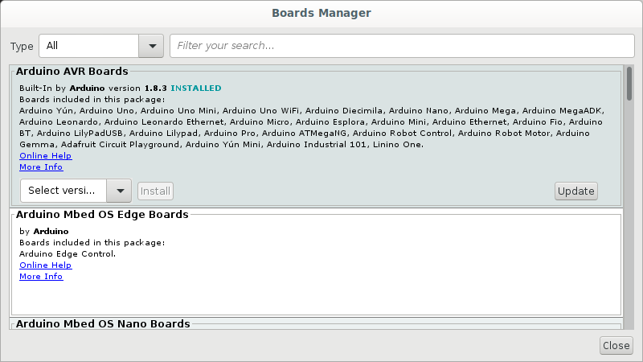
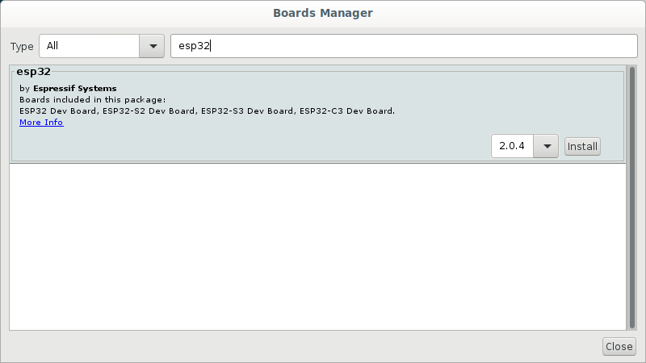

:::::::::::::::::::::::::::::::::::::: questions 

- What is an IDE?
- What is the purpose of the Arduino IDE?
- Which microcontrollers can be programmed with the Arduino IDE?
- How is the Arduino IDE used to program a microcontroller?
- How are microcontroller boards connected to the computer?
- How does the Arduino IDE connect to the microcontroller?
- How would you upload a program?
::::::::::::::::::::::::::::::::::::::::::::::::


::::::::::::::::::::::::::::::::::::: objectives

- Explain what an IDE is.
- Explain what the Arduino IDE is used for.
- Identify microcontrollers that can be programmed with the Arduino IDE.
- Run the Arduino IDE.
- Connect the microcontroller board to the computer.
- Connect the microcontroller to the Arduino IDE.
- Enter, compile and upload code.

::::::::::::::::::::::::::::::::::::::::::::::::

## Introduction

Just like computers, microcontrollers have memory into which we can load programs. To make things easier and to be more productive, programmers have developed software called Integrated Development Environments (IDE). The IDEs provide an editor into which one can type the programming instructions and they usually also make provision for ***syntax highlighting***. Syntax highlighting just means that certain keywords are coloured and that makes it much easier to read. The IDEs also provide ways of uploading code to devices and running the programs. The Arduino IDE was specifically developed for writing programs that uploaded and run on motorcontrollers. Originally it was aimed just at the Arduino but because it is such a convenient environment to work in, it has now been extended to also workwith other microcontrollers.

## Running the Arduino IDE

For this episode we have to assume that you were able to successfully install the Arduino IDE and that you are able to start the software from the start menu or the desktop of your computer. When you run the software you will first see the splash window:


<figcaption align = "center">
 <b>The Arduino splash screen which is shown when the program starts</b>
 </figcaption>
 
 
After a while the IDE will open. It is actually quite a simple interface. At the top you should see the File, Edit, Sketch, Tools and Help menu items. Just below the menu there are five icons to the left and one on the far right. Below the icons you should see a tab with a filename and a white editing area. Below the editor is a black terminal:


<figcaption align = "center">
 <b>The Arduino IDE main window</b>
 </figcaption>
 
 
The white area is where you will be typing the code that will be uploaded to the microcontroller. In the black area you will see messages about the *compilation* of the code and the uploading process. Right at the bottom is a status bar where you will eventually be able to see whether the IDE could connect to your motorcontroller.

The first time you run the IDE the status bar will show the string `Arduino Uno on /dev/ttyAM0` and in the editor you will see some skeleton code. Note the syntax highlighting:

```c
void setup() {
  // put your setup code here, to run once:

}

void loop() {
  // put your main code here, to run repeatedly:

}
```

## Configuring the IDE for use with boards other than an Arduino Uno

If you will be using an Arduino or an Arduino compatible device, you don't have to complete the steps in this section and you can skip to the secion on **compiling**.

By default the IDE is configured to program an Arduino Uno but we will be using an ESP32 WROOM 32 board so we first need to configure the IDE before we can start coding. Start by clicking on the `File` menu item and then on `Preferences`. Towards the bottom of the Preferences window you should find a text area with the label `Additional Boards Manager URLs:`:


To find the appropriate URL you need to open a web browser and navigate to: `https://github.com/arduino/Arduino/wiki/Unofficial-list-of-3rd-party-boards-support-urls`. For the ESP32-WROOM-32 you have to find the line that reads:

**Espressif ESP32:** https://raw.githubusercontent.com/espressif/arduino-esp32/gh-pages/package_esp32_index.json

Copy and paste the address into the text area of the preferences window:


Click on `OK`

What we have just done is to tell the IDE where to find more information about the ESP32 boards. Because the ESP32 series use a different microcontrollers to the Arduino Uno our programs have to be *compiled* differently. By default all the Arduino boards are immediately available for selection in the IDE but for other boards we have to give the IDE a place where it can find the information for *compiling* the code for those other boards.

## What is "compiling"?
We have used the term "compiling" a few times now. But what is that? You'll notice, that once we start programming, the programming language uses English words. But, computers do not understand English. Computers understand only 0 and 1. A compiler takes the human readable programming language that we entered into the editor and "translates" it into instructions consisting of 0 and 1 that makes complete sense to the microcontroller. Although all microcontrollers understand 0 and 1, the instructions for different microcontrollers differ. The 0s and 1s are like sounds are to us humans. But different human languages combine the sounds differently. Similarly the 0s and 1s need to be arranged differently for microcontrollers designed by different manufacturers or even different models of microcontrollers manufactured by the same manufacturer. For this reason we have to tell the IDE which microcontroller board we are using so that the compiler can translate our English code into the correct `dialect` of microcontroller language.

## Selecting the correct board

To select the board you want to compile for click on the `Tools` menu item, and then on `Board:`. On the dropdown menu, select the microcontroller board that you will be using. If it is not in the list, click on `Boards Manager` which is right at the top. The `Boards Manager` should pop up. 



There will be several options available. If you will be using the ESP32 scroll down to find **esp32**. You can also type esp32 in the the text area right at the top of the window and then press enter. This will then perform a search and you should be able to find the esp32 option a little quicker. If you hover your mouse over the **esp32** secion, a box with a version and an `Install` button should appear. Leave the version, which should be the latest, as is and click on the `Install` button.



When the installation is completed click the `Close` button. 

If your Arduino is on the list to start with and you don't need to install other boards, then just select the board you are using. If you had to install the `esp32` boards, you will have to now click on the `Tools` menu option again and then select `Boards`. There should now be options for `Arduino AVR boards` and `ESP Arduino`. Select the ESP option and then select the board you are using which, if you are using the `ESP32 WROOM 32`, should be `DOIT ESP32 DevKit V1`

## Connecting the board to the computer

To connect the motorcontroller board to the computer we need a USB cable. USB cables come in different flavours. You might know this from experience with your mobile/cell phone. The image below shows the names and shapes of the different types of USB connectors:


<figcaption align="center">Attribution: Milos634, CC BY-SA 4.0 <https://creativecommons.org/licenses/by-sa/4.0>, via Wikimedia Commons</figcaption>
 
Most computers still have USB type A ports. The latest laptops might have USB C. An Arduino Uno usually has a type B USB port. So for an Uno you will need a cable that has a type A connector on the one side and a type b connector on the other. If your laptop has a type C port you will need type A to type C converter to make the cable fit. An Arduino nano will probably need a type A to type Mini-B cable and an ESP32 will need a type A to Micro-B cable. Chances are that, if you are using devices provided by your host, that they will have the correct cables. Just be aware that if your laptop has a type C port you might need an adapter.
 
You can now use the cable to connect the motorcontroller board to the computer. Windows computers usually play a sound when you connect a USB device.
 
## Selecting the correct serial port in the IDE

You should now be able to get your Arduino IDE to recognise your motorcontroller board. In the IDE, click on `Tools` and then on Port. You should see at leat one but perhaps more ports listed. Your IDE might already have selected the port automatically when you connected the cable. On Windows the devices are usually named COM1, COM2, COM3 etc. Figuring out which port is being used is sometimes a bit messy. Your instructor or workshop helpers might be able to assist you with this.

On Windows it might also be necessary for you to install the serial drivers required for the ESP32. If you notice the `Port` item on the `Tools` menu is greyed out then this is probably required. To download the drivers go to:
 
[CP210x USB to UART Bridge](https://www.silabs.com/developers/usb-to-uart-bridge-vcp-drivers?tab=downloads)
 
Select:
 ```
CP210x Windows Drivers
v6.7.6
9/3/2020
```
 
When you click on the link it should download a file called `CP210x_Windows_Drivers.zip`, to your computer. Right click and extract the contents from the zip file. There should be two `.exe` files extracted. Depending on your computer you have to double click on one of these to install the driver. If you are not sure which one to select you can click on the x86 version first. It will either install or you'll get a message warning you that your computer has a 64bit architecture and that you should install the 64bit version. In that case double click the x64 version to install the driver. After installation the `Port` item on the `Tools` menu should not be greyed anymore and you should be able to click on it to select a COM port.
 
 
## Upload our first sketch
 
 If all went well you should now be able to upload a program to the motorcontroller board. We are going to enter a very simple program just to make sure everything is working. En the editor part of the IDE, modify the code to read as follows:
 
 ```c
 void setup() {
  Serial.begin(9600);
 }
 
 void loop() {
  Serial.println("Hello");
  delay(5000);
 }
 ```
 
We'll go into more detail about programming the motorcontroller in the next episode. This little program is just for testing. All it is going to do is to print the word `Hello` in the ***monitor***, which we will open after compiling and uploading the program. To compile and upload press the second button from the left with the arrow pointing to the right. See the image below:
 

 
If all goes well you should see messages displayed in the terminal section below the editor. The messages should be similar to what is shown in the image. The progress counter should say `(100%)`, indicating the all of the compiled code has been uploaded successfully:
 
 
 
 If you are getting an error message similar to this,
 ```
 Connecting.....................................An error occurred while uploading the sketch
.

A fatal error occurred: Failed to connect to ESP32: Wrong boot mode detected (0x13)! The chip needs to be in download mode.
For troubleshooting steps visit: https://docs.espressif.com/projects/esptool/en/latest/troubleshooting.html
```
 
 then you might have to download the `BOOT` button on your microcontroller board. If you wait for the message to say `Connecting ..` and start holding down the button when the dots appear, the code will suddenly start uploading.

You can now open the serial monitor by clicking first on `Tools` and then on `Serial Monitor`. The word `Hello` should now be printed to the monitor every five seconds.
 


::::::::::::::::::::::::::::::::::::: keypoints 

- Explain what an IDE is.
- Explain what the Arduino IDE is used for.
- Identify microcontrollers that can be programmed with the Arduino IDE.
- Run the Arduino IDE.
- Connect the microcontroller board to the computer.
- Connect the microcontroller to the Arduino IDE.
- Enter code in the editor
- Compile and upload the 
- Open the serial monitor

::::::::::::::::::::::::::::::::::::::::::::::::

[r-markdown]: https://rmarkdown.rstudio.com/
