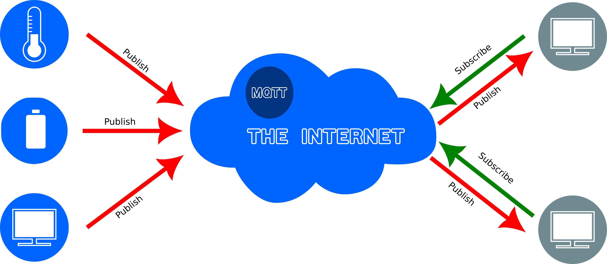
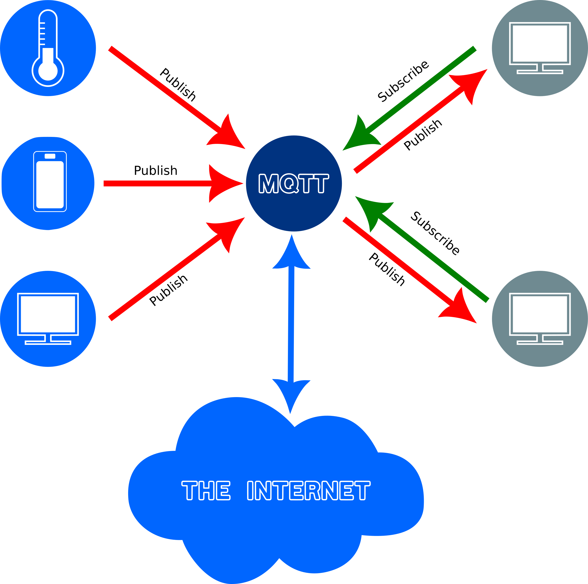

:::: questions 

- What is MQTT?
- How does MQTT work?
- What is an MQTT publisher?
- What is an MQTT broker?
- What is an MQTT subscriber?
- What is a client?
- What is a server?

::::

:::: objectives

- Explain how MQTT works

:::::

## Add MQTT

### What is MQTT?

[Message Queuing Telemetry Transport](https://en.wikipedia.org/wiki/MQTT)

MQTT (originally an initialism of MQ Telemetry Transport[a]) is a lightweight, publish-subscribe, machine to machine network protocol. It is designed for connections with remote locations that have devices with resource constraints or limited network bandwidth. 

There are three components to the MQTT architecture, publishers, subscribers and a broker. Publishers are devices on the Internet of Things that publish messages with a specific topic to a broker. Subscribers subscribe to specific topics on the broker. When a new value for a specific topic is published by a publisher, then all the subscribers to that topic will receive it. 


:::: challenge

Discuss, with the person next to you the following:

1. What kind of devices we are likely to find on the Internet of things?
2. Who would typically publish information from such devices?
3. Who would typically subscribe to the data?

::::

### Importing the MQTT library into the Arduino IDE

To be able to enable MQTT functionality we need to add yet another library to our Arduino IDE. As before select `Tools` on the menu and then `Manage Libraries`. Enter `PubSubClient` into the text box for searching. Scroll down until you find `PubSubClient by Nick O'Leary` and click the Install button:


There are three pieces of information that we will need before we enter the code for sending and messages via MQTT:

1. The `ssid` of your Internet access point
2. The password for the access point
3. The IP address or hostname of your MQTT broker

There are several free MQTT servers available on the Internet. Alternatively one can set up one's own server running an MQTT broker. In the diagrams below two alternative setups are shown. In the first case there is an MQTT server on the Internet that devices can publish or subscribe to. In the second case a local MQTT broker is used which has the advantages that all network traffic can be private, it doesn't have to be shared to the Internet. For the purposes of this workshop for instance we might want to set up our own server so that we are not dependent on the Internet.






In the sketch below you will have to replace the values assigned to the variables `ssid`, `password` and `mqtt_server`. Your instructor should provide you with the appropriate values which will depend on the MQTT broker you are going to use.

:::: instructor

Include instructions on setting up a Raspberry Pi with RaspAP and Mosquitto

::::

For now we will continue as if your instructor has set up a local network that includes an access point to which your computer has to connect and an MQTT broker. You might, or might not, be connected to the Internet once you connect to the access point, but that won't matter.


```c
#include <DHT.h>
#include <WiFi.h>
#include <PubSubClient.h>

#define DHT_SENSOR_TYPE DHT22
#define DHT_SENSOR_PIN 32 // ESP32 pin connected to DHT sensor
#define LIGHT_SENSOR_PIN 36 // ESP32 pin GIOP36 (ADC0)

const int readingdelay = 3000;
const char* ssid = "raspi-webgui";
const char* password = "w0rksh0p";
const char* mqtt_server = "192.168.0.1";

DHT dht_sensor(DHT_SENSOR_PIN, DHT_SENSOR_TYPE);
WiFiClient espClient;
PubSubClient client(espClient);

String topic_temperature = "/dht22/temperature";
String topic_light = "/ldr/light/";

void setup() {
  Serial.begin(9600); // initialize serial
  Serial.println(F("Starting ..."));
  dht_sensor.begin(); // initialize the DHT sensor
  setup_wifi();
  client.setServer(mqtt_server, 1883);
  client.setCallback(callback);
}

void loop() {
  if (!client.connected()) {
    reconnect();
  }
  client.loop();

  float temperature = dht_sensor.readTemperature();   // read temperature in Celsius
  int lightlevel = analogRead(LIGHT_SENSOR_PIN);     // read light level


  if (isnan(temperature)) {

    Serial.println("Failed to read from DHT sensor!");

  } else {
    /* When reading the temperature and light levels, we get the values
       as numbers, but when we send it to the MQTT broker the values
       have to be converted to strings. We therefore have to declare
       variables of type char into which the number values can be transferred
    */
    char tempString[8];
    char lightString[8];

    /**
     * Transfer the number values into strings
     */
    dtostrf(temperature, 1, 2, tempString);
    dtostrf(lightlevel, 1, 2, lightString);

    // Print the temperature to the monitor
    Serial.print("Temperature: ");
    Serial.println(temperature);
    // Publish the temperature to the MQTT broker
    publishMQTT(topic_temperature, tempString);

    // Print the light level to the monitor
    Serial.print("Light: ");
    Serial.println(lightlevel);
    // Publish the light level to the MQTT broker
    publishMQTT(topic_light, lightString);

    // wait a 3 seconds between readings
    delay(readingdelay);
  }
}

void setup_wifi() {
  delay(10);
  // We start by connecting to a WiFi network
  Serial.println();
  Serial.print("Connecting to ");
  Serial.println(ssid);

  WiFi.begin(ssid, password);

  while (WiFi.status() != WL_CONNECTED) {
    delay(500);
    Serial.print(".");
  }

  Serial.println("");
  Serial.println("WiFi connected");
  Serial.println("IP address: ");
  Serial.println(WiFi.localIP());
}

void callback(char* topic, byte * message, unsigned int length) {
  Serial.print("Message arrived on topic: ");
  Serial.print(topic);
  Serial.print(". Message: ");
  String messageTemp;

  for (int i = 0; i < length; i++) {
    Serial.print((char)message[i]);
    messageTemp += (char)message[i];
  }
  Serial.println();
}

void reconnect() {
  // Loop until we're reconnected
  while (!client.connected()) {
    // Create a random client ID
    String clientId = "ESP32Client-";
    clientId += String(random(0xffff), HEX);
    Serial.print(clientId + " attempting MQTT connection...");
    // Attempt to connect
    if (client.connect(clientId.c_str(), "jannetta", "f0r3v3rl1n8x")) {
      Serial.println("connected");
    } else {
      Serial.print("failed, rc=");
      Serial.print(client.state());
      Serial.println(" try again in 5 seconds");
      // Wait 5 seconds before retrying
      delay(500);
    }
  }
}

void publishMQTT(String topicString, char payload[8]) {
  unsigned int length = topicString.length() + 1;
  char topic[length];
  topicString.toCharArray(topic, length);
  Serial.print(topic);
  Serial.print(": ");
  Serial.println(payload);
  client.publish(topic, payload, true);
}

String byteArrayToString(byte * byteArray, unsigned int length) {
  String messageTemp;
  for (int i = 0; i < length; i++) {
    messageTemp += (char)byteArray[i];
  }
  return messageTemp;
}
```

:::::::::::::::::::::::::::: discussion

Explanation of the code

::::::::::::::::::::::::::::

:::: keypoints 

- Keypoint

:::::

[r-markdown]: https://rmarkdown.rstudio.com/
